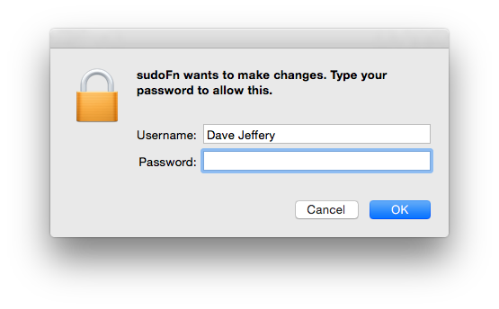

sudo-fn
=======

Call a node function with sudo privileges (prompts the user for admin privileges with a native OS X dialog).

**Note: OS X Only**

Uses [sudo-prompt](https://www.npmjs.com/package/sudo-prompt) and [cmd-fn](https://www.npmjs.com/package/cmd-fn).

Installation
------------
```
npm install sudo-fn
```

Usage
-----
```javascript
// To use something other than process.title as the app name.
// Must be alphanumeric (may contain spaces).
sudoFn.setName('Your app name')
```

```javascript
// To call a function with admin (sudo) privileges.
sudoFn.call(options, callback);
```

Options (also see [cmd-fn](https://www.npmjs.com/package/cmd-fn)):

```
module       module name e.g.: 'fs'
function     function name
params       function arguments specified as an array e.g.: ["foo", "bar"]
type         the type of target function, can be:
                    'node-callback' or
                    'promise'
cwd          change working directory context
```

After calling sudoFn an authentication dialog will display (see below).
If challenge is successful then the requested function will be called with admin privileges.
The requested function is called in a child process, use absolute paths for non-core modules.




Examples
--------

**Simple Local Module Example**

If I wanted to do the equivalent of:
```javascript
require('./foo').bar('baz', {'hello':'world'});
```

Then I could do:
```javascript
sudoFn({
  module: __dirname + '/foo',
  function: 'bar',
  params: ['baz', {'hello':'world'}]
}, cb);
```

********

**Node Callback Example**

If I wanted to read a privileged admin directory:

```javascript
require('fs').readdir("/var/audit", cb);
```

Then I could do:
```javascript
sudoFn({
  module: 'fs',
  function: 'readdir',
  params: ['/var/tmp'],
  type: 'node-callback'
}, cb);
```

********

Author
------

Dave Jeffery ([@DaveJ](https://twitter.com/DaveJ))
